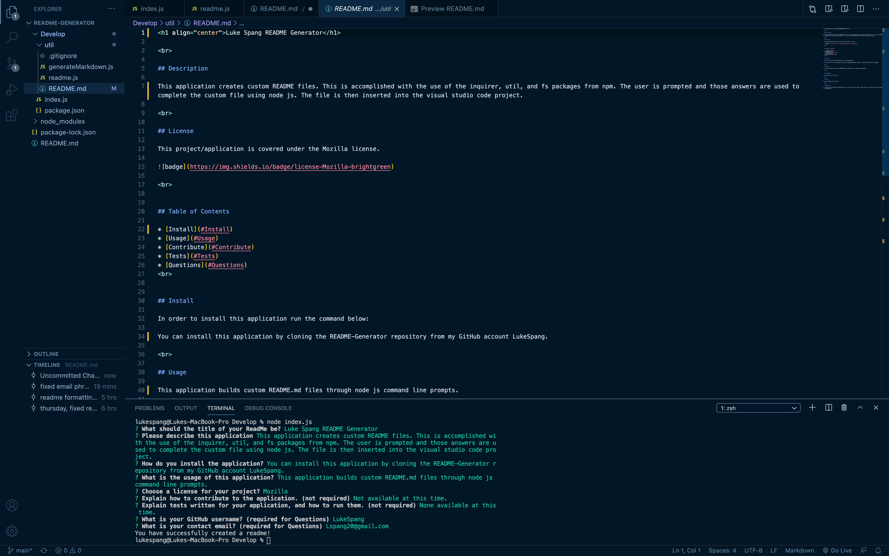

<h1 align="center">Luke Spang README Generator</h1>

 
    
## Description

This application creates custom README files. This is accomplished with the use of the inquirer, util, and fs packages from npm. The user is prompted and those answers are used to complete the custom file using node js. The file is then inserted into the visual studio code project.

 

## License

This project/application is covered under the Mozilla license.

 

## Table of Contents

* [Install](#Install)
* [Usage](#Usage)
* [Contribute](#Contribute)
* [Tests](#Tests)
* [Questions](#Questions)
* [Example](#Example)
 
    

## Install

In order to install this application run the command below:

You can install this application by cloning the README-Generator repository from my GitHub account LukeSpang.

 

## Usage

This application builds custom README.md files through node js command line prompts.

 

## Contribute

Not available at this time.

 

## Tests

None available at this time.

 

## Questions

If there are any questions regarding the repo, or any techincal issues, please feel free to contact me at my personal email: Lspang20@gmail.com. You can also find me at (https://github.com/LukeSpang)

## Example

    
